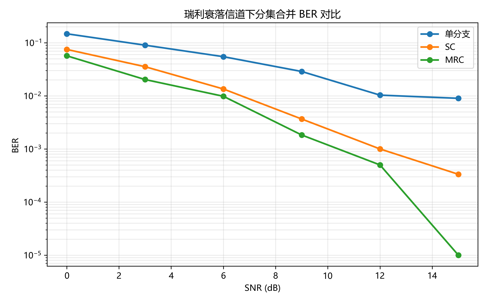
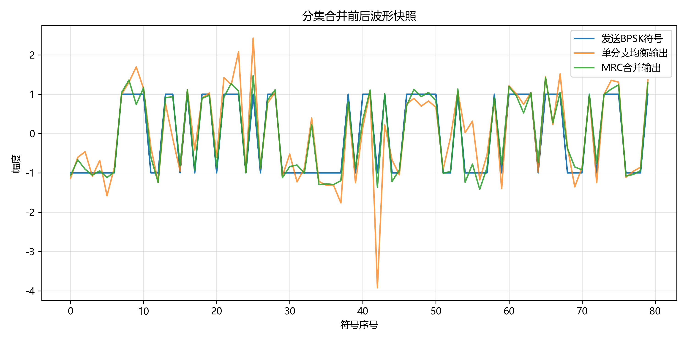
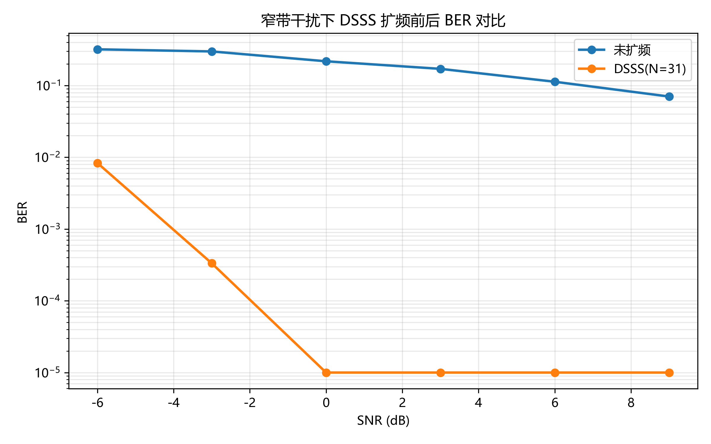
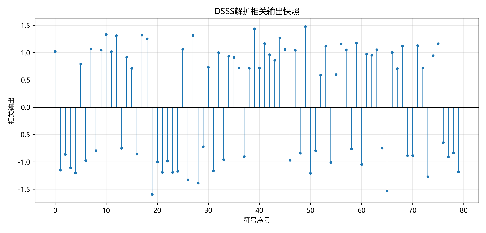

# 无线通信技术实验报告：分集与扩频通信

## 1. 实验目的

本实验旨在掌握无线通信中的分集合并与直接序列扩频（DSSS）技术，理解其在瑞利衰落环境和窄带干扰环境下对误码率（BER）性能的改善效果。同时熟悉 GitHub 实验提交流程和自动评分机制。

## 2. 实验原理

### 2.1 分集合并

在无线信道中，瑞利衰落会导致信号经历多径干扰和相位叠加，产生快速的幅度波动，容易出现深衰落，从而使接收端误码率突然增大。

分集合并利用多个独立接收分支接收同一信号，提高接收信号的稳定性。选择合并（SC）在多个分支中选择信噪比最高的那个分支进行检测；最大比合并（MRC）则对各分支按信道增益加权并相加，实现最佳信噪比。这两种方案都能获得分集增益，MRC 通常优于 SC，因为它利用了全部分支的信号能量。

### 2.2 扩频通信

直接序列扩频（DSSS）通过将原始比特信号与伪随机噪声（PN）序列相乘，将窄带信号扩展到更宽的频带。扩频后信号的功率谱密度降低，窄带干扰在解扩过程中被摊薄，从而提高抗干扰能力。

m 序列是一种最大长度序列，具有平衡性和良好的自相关特性。扩频阶段将 0/1 比特映射为 +1/-1，并与 PN 芯片相乘；解扩阶段对接收芯片与相同 PN 序列进行相关运算，再做硬判决恢复比特。

处理增益由扩频因子决定，其计算公式为：

```text
G_dB = 10 * log10(spreading_factor)
```

扩频因子越大，处理增益越高，对窄带干扰的抑制越明显，但带宽开销也越大。

## 3. 实验环境

- Python 版本：Python 3.11.7
- 主要依赖：NumPy、Matplotlib、pytest
- 依赖列表：
  - numpy>=1.23.0
  - matplotlib>=3.6.0
  - pytest>=7.0.0
  - pylint>=2.15.0
  - python-docx>=1.1.0
  - python-pptx>=0.6.23
- AI 助手使用情况：使用 Copilot 辅助生成报告结构与部分代码说明，并确保对每个核心函数的实现逻辑进行了理解与验证。

## 4. 实验方法与步骤

### 4.1 Part 1：分集合并

1. 在 `src/part1_diversity.py` 中实现 BPSK 调制、瑞利平坦衰落信道建模以及多分支接收。
2. 实现选择合并（SC）和最大比合并（MRC）算法：SC 选择信噪比最高分支，MRC 对各分支按信道增益加权叠加。
3. 生成不同 SNR 下的随机比特序列，并计算每种分集方案的 BER。
4. 将仿真结果绘制为 BER 曲线，并保存为 `results/diversity_ber_curve.png` 和 `results/diversity_waveform_snapshot.png`。

### 4.2 Part 2：DSSS 扩频通信

1. 在 `src/part2_spread_spectrum.py` 中实现 m 序列生成、DSSS 扩频、相关解扩、处理增益计算。
2. 生成 PN 序列并将比特序列扩频为芯片序列。
3. 在扩频信号上叠加窄带干扰和 AWGN 噪声，并进行解扩恢复。
4. 计算未扩频与 DSSS 系统在不同 SNR 下的 BER，并绘制 BER 对比曲线。
5. 另外生成相关快照图 `results/dsss_correlation_snapshot.png`，用于展示解扩相关值分布。

## 5. 实验结果






## 6. 结果分析与讨论

1. 瑞利衰落会造成深衰落，因为多径分量叠加的相位和幅度随机变化，某些时刻不同路径可能发生严重相消，导致接收信号幅度显著降低。
2. SC 和 MRC 的合并思想不同：SC 只选择一个最佳分支，结构简单；MRC 则对所有分支按信道增益加权叠加，能够充分利用每个分支的信号能量。
3. MRC 通常优于 SC，因为它综合利用了多个分支的信号，避免了丢弃次优分支信息，获得更高的信噪比和更低的 BER。
4. DSSS 的处理增益由扩频因子决定，理论上 `G_dB = 10 * log10(N)`，其中 N 是每比特对应的芯片数。扩频因子越大，解扩后有用信号与干扰的比值越高。
5. 窄带干扰经过解扩后被摊薄，因为干扰在扩频带宽上表现为低功率密度，且与本地 PN 序列不相关，相关运算后其有效能量被大量削弱。
6. 实验中 BER 曲线应符合理论预期：分集合并方案的 BER 明显低于单分支接收，MRC 优于 SC；DSSS 系统在窄带干扰条件下的 BER 显著优于未扩频系统。

## 7. 实验心得

通过本实验，我进一步理解了分集技术和扩频通信的基本原理。分集合并显著提高了瑞利衰落信道中的抗深衰落能力，MRC 的性能优越性来自对多分支信号的加权融合。DSSS 扩频则通过把信号展宽、降低功率密度，实现了对窄带干扰的有效抑制。

在实验过程中，我还掌握了 GitHub 代码提交与自动评分流程，并合理使用 AI 助手辅助完成报告撰写与代码注释。AI 助手仅用于建议内容结构和生成说明文字，所有核心函数均由我自行理解并遵循实验要求实现。

## 8. 参考资料

- 课程课件：第8章 分集
- 课程课件：第9章 扩展频谱通信
